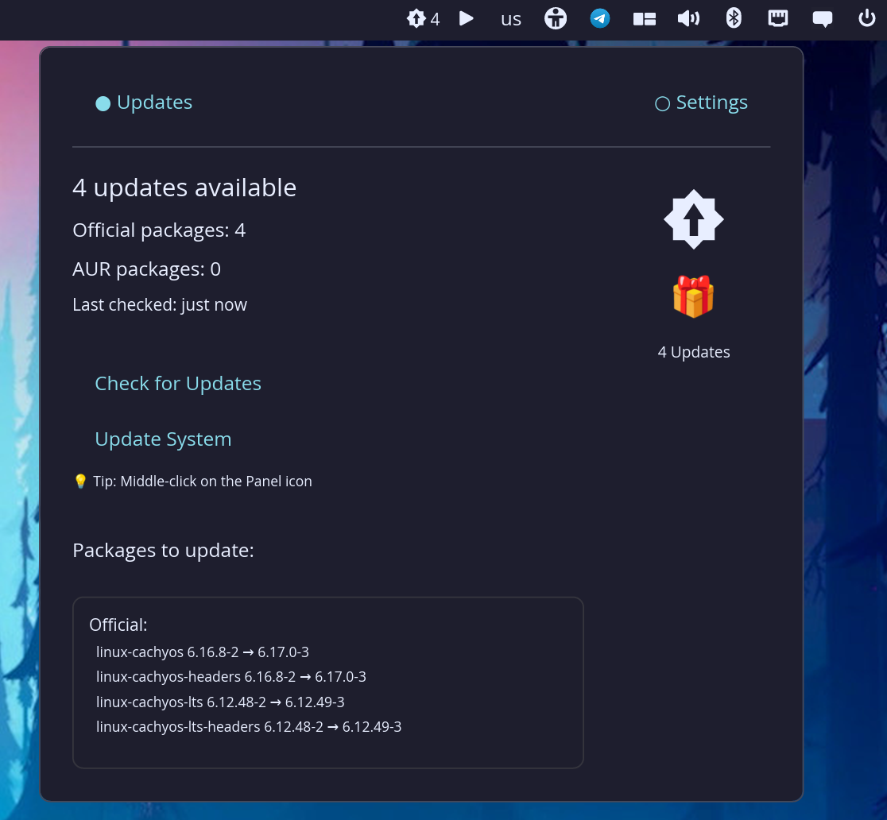
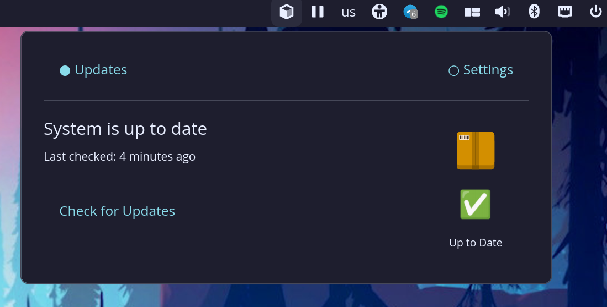
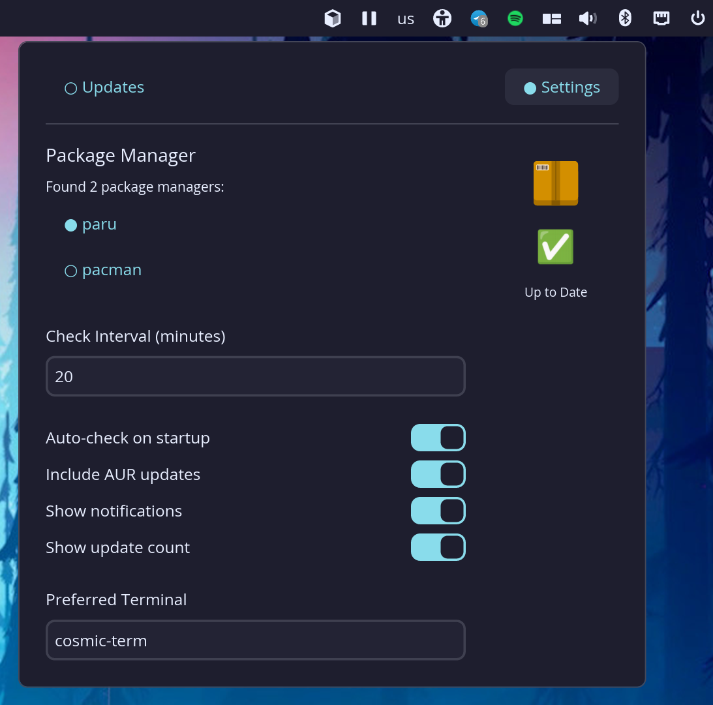

# COSMIC Package Updater Applet

A lightweight and efficient package update notifier applet for the COSMIC desktop environment on Arch Linux. Stay informed about system updates with real-time notifications and seamless integration into your COSMIC panel.

## Installation

```bash
paru -S cosmic-applet-package-updater-git
```



## Features

### 📦 **Package Manager Support**
- **Pacman**: Official Arch Linux repository packages
- **Paru / Yay **: Recommended - supports both official and AUR packages
- **Auto-detection**: Automatically discovers available package managers on first launch

### 🔄 **Update Management**
- **Visual Indicators**: Panel icon changes based on update status
  - ✅ Package icon: System up to date
  - 🎁 Update icon with count: Updates available
  - ⏳ Refresh spinner: Checking for updates
  - ❌ Error icon: Error occurred
- **Automatic Checking**: Configurable interval-based update checking (default: 60 minutes)
- **One-Click Updates**: Launch system updates directly from the applet in your preferred terminal
- **Detailed Package List**: View all available updates with version information, separated by official and AUR packages
- **Instance Synchronization**: Multiple applet instances stay in sync automatically

### 🎨 **User Interface**
- **Clean Two-Tab Layout**:
  - **Updates Tab**: Shows update status, package list, and action buttons
  - **Settings Tab**: Configure all preferences in one place
- **Visual Package Illustration**: Dynamic icon and emoji showing current status
- **Smart Button Placement**: Update System button appears only when updates are available
- **Scrollable Package List**: View all updates in an organized, easy-to-read format

### ⚙️ **Configuration Options**
- **Package Manager Selection**: Choose between Pacman/Paru/Yay
- **Check Interval**: Set how often to check for updates (1-1440 minutes)
- **Auto-check on Startup**: Automatically check for updates when applet starts
- **Include AUR Updates**: Toggle AUR package update detection
- **Show Notifications**: Enable/disable update notifications (feature ready)
- **Show Update Count**: Display the number of updates in the panel icon
- **Preferred Terminal**: Set your preferred terminal emulator (default: cosmic-term)

### ⌨️ **Quick Actions**
- **Left Click**: Open the applet popup window
- **Middle Click on Panel Icon**: Launch system update directly
- **Update System Button**: Opens terminal with update command, then automatically re-checks

### 🔧 **Smart Background Operations**
- **File-Based Locking**: Prevents multiple instances from checking simultaneously
- **Automatic Retry Logic**: Retries failed checks once to handle temporary errors
- **File Watcher Sync**: When one instance checks for updates, all others sync within 100ms
- **Post-Update Check**: Automatically re-checks for updates after terminal closes (3-second stabilization delay)
- **Resource Efficient**: Minimal system impact when idle

## Screenshots

### Updates Tab

*The main updates tab showing available updates with package details*

### Settings Tab

*Configure package manager, intervals, and preferences*

## Installation

### From AUR (Recommended)

Install using your preferred AUR helper:

```bash
# Using paru
paru -S cosmic-applet-package-updater-git

# Using yay
yay -S cosmic-applet-package-updater-git
```

**AUR Package**: [cosmic-applet-package-updater-git](https://aur.archlinux.org/packages/cosmic-applet-package-updater-git)

### Build from Source

1. **Clone the repository**:
   ```bash
   git clone https://github.com/your-repo/cosmic-applet-package-updater.git
   cd cosmic-applet-package-updater
   ```

2. **Build the project**:
   ```bash
   cd package-updater
   cargo build --release
   ```

3. **Install system-wide** (optional):
   ```bash
   sudo install -Dm755 target/release/package-updater /usr/bin/cosmic-applet-package-updater
   ```

### Prerequisites

- **Operating System**: Arch Linux or Arch-based distribution
- **Desktop Environment**: COSMIC Desktop
- **Rust**: 1.80 or newer
- **Package Manager**: At least one of:
  - `pacman` (required for official packages)
  - `paru` (recommended, for AUR support)
  - `yay` (alternative AUR helper)
- **System Tools**:
  - `checkupdates` (from `pacman-contrib` package)
  - Terminal emulator (cosmic-term recommended)

## Usage

### Adding the Applet to COSMIC Panel

After installation, add the Package Updater applet to your COSMIC panel:

1. Right-click on the COSMIC panel
2. Select "Panel Settings" or "Configure Panel"
3. Find "Package Updater" in the available applets list
4. Click to add it to your panel

The applet will appear as an icon in your COSMIC panel.

### Using the Applet

**Updates Tab**:
- View current update status with visual indicators
- See detailed package list with version information
- Packages are organized into Official and AUR categories
- Click "Check for Updates" to manually refresh
- Click "Update System" to launch updates in terminal (appears only when updates available)
- Tip displayed: "Middle-click on the Panel icon" for quick updates

**Settings Tab**:
- **Package Manager**: Select from detected package managers
- **Check Interval**: Set minutes between automatic checks (1-1440)
- **Auto-check on startup**: Toggle automatic checking when applet starts
- **Include AUR updates**: Enable/disable AUR package detection
- **Show notifications**: Enable/disable update notifications
- **Show update count**: Toggle update count badge on panel icon
- **Preferred Terminal**: Set terminal command (default: cosmic-term)

**Quick Actions**:
- **Left Click**: Open/close applet popup
- **Middle Click on Panel Icon**: Launch system update immediately

### How Updates Work

1. **Checking for Updates**:
   - Automatic checks run based on your configured interval
   - Manual checks via "Check for Updates" button
   - File-based locking prevents simultaneous checks across instances

2. **Installing Updates**:
   - Click "Update System" or middle-click the panel icon
   - Terminal opens with update command for your package manager
   - Complete the update process in the terminal
   - Close terminal when done
   - Applet automatically re-checks for updates after 3 seconds
   - All applet instances sync the new state within 100ms

3. **Instance Synchronization**:
   - Multiple applet instances stay synchronized automatically
   - When one instance checks for updates, others sync via file watcher
   - Prevents duplicate checks with file-based locking

## Configuration

Settings are stored in:
```
~/.config/cosmic/com.cosmic.PackageUpdater/
```

Lock and sync files (automatically managed):
```
$XDG_RUNTIME_DIR/cosmic-package-updater.lock
$XDG_RUNTIME_DIR/cosmic-package-updater.sync
```

## How It Works

### Update Detection

The applet uses these commands to detect updates:

- **Official Packages**: `checkupdates` (from pacman-contrib)
- **AUR Packages (Paru)**: `paru -Qu --aur`
- **AUR Packages (Yay)**: `yay -Qu --aur`

### Smart Features

- **Retry Logic**: Failed checks are automatically retried once after 1 second
- **Exit Code Handling**: Correctly interprets exit codes (2 for checkupdates, 1 for paru/yay means no updates)
- **File-Based Locking**: Uses `$XDG_RUNTIME_DIR/cosmic-package-updater.lock` to prevent simultaneous checks
- **File Watcher Sync**: Monitors `$XDG_RUNTIME_DIR/cosmic-package-updater.sync` to sync instances
- **Debouncing**: 3-second minimum between syncs to prevent rapid repeated checks

## Technical Details

- **Framework**: Built with libcosmic (COSMIC's UI toolkit)
- **Language**: Rust
- **Async Operations**: All package manager calls are non-blocking (tokio)
- **Configuration**: Persistent settings with cosmic-config
- **File Watching**: Uses the `notify` crate for instance synchronization

## Troubleshooting

### Applet not appearing in panel
- Ensure the applet is properly installed: `which cosmic-applet-package-updater` should return a path
- Restart the COSMIC panel or log out and back in
- Check COSMIC Settings → Desktop → Panel settings

### No package managers found
- Install `pacman-contrib` for the `checkupdates` command: `sudo pacman -S pacman-contrib`
- For AUR support, install `paru` or `yay`
- Click "Discover Package Managers" button in the Settings tab
- Ensure package managers are in your `$PATH`

### Updates not showing correctly
- Verify `checkupdates` works from command line: `checkupdates`
- Check that the correct package manager is selected in Settings
- Try clicking "Check for Updates" manually
- Check system logs for error messages

### Applet keeps checking repeatedly on startup
- This was a bug that has been fixed
- The first sync event on startup is now ignored
- Only syncs when last check was more than 3 seconds ago

### Multiple instances out of sync
- The file watcher should automatically sync all instances
- If issues persist, remove sync file: `rm $XDG_RUNTIME_DIR/cosmic-package-updater.sync`
- Restart the applet

### Terminal not launching
- Verify the preferred terminal setting in Settings tab
- Ensure the terminal is installed: `which cosmic-term`
- Try a different terminal like `konsole` or `kitty`

### "Update check already in progress" errors
- Another instance is currently checking for updates
- The lock file prevents simultaneous checks
- Wait a few seconds and try again
- If persistent, remove lock file: `rm $XDG_RUNTIME_DIR/cosmic-package-updater.lock`

## Contributing

Contributions are welcome! Please feel free to submit pull requests or open issues for bugs and feature requests.

## License

This project is licensed under the GPL-3.0 License - see the LICENSE file for details.

## Credits

Developed for the COSMIC Desktop community.

## Links

- **AUR Package**: [cosmic-applet-package-updater-git](https://aur.archlinux.org/packages/cosmic-applet-package-updater-git)
